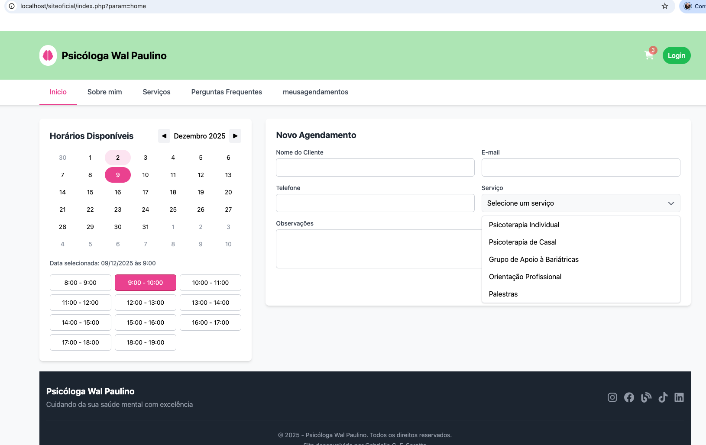

Nome do projeto: Site de Gestão de Clientes para uma Psicóloga

Descrição do propósito do sistema: realizar gestão de clientes através de serviços como: cadastrar cliente, consultar cadastro, editar cadastro e excluir cadastro. Aqui, utilizei índices para facilitar a manutenção, consulta e modelagem de dados. O sistema possui uma interface amigável, que conta com várias abas, sendo elas "Início (onde o cliente pode fazer o seu cadastro)", "Sobre Mim", "Serviços", "Perguntas Frequentes" e "Meus Agendamentos"(a área do usuário (onde ele faz LOGIN) para que ele possa consultar os serviços e a data/horário do(s) serviço(s) que solicitou). Futuramente, ainda nesta área do usuário, pretendo implantar consultas com relação às datas de pagamentos e formas de pagamento como QRCode, Pix, Transferência Bancária, etc. Além disso, pretendo implantar nesta área um indicador de frequência às consultas gameficado, para que os clientes se engajem em continuar frequentando as atividades psicoterapêuticas.

Neste projeto, fiz o template levando em consideração a manutenibilidade e na tentativa deixar o site está amigável e com leitura orgânica. Nos "bastidores", utilizei os padrões MVC para estruturar o meu projeto.	

Instruções de instalação e execução: baixar todos os arquivos da pasta siteoficial mais recente e utilizar phpMyAdm para acessar o banco de dados (PHP e MySQL); utilizar o VSCode ou editor de sua preferência para acesssar os códigos relativos a interface. Ao utilizar o navegador, inserir "http://localhost/phpmyadmin/index.php?route=/database/export&db=Lastversion"para acessar o banco de dados e o "http://localhost/siteoficial/" para acessar a lista de clientes, já que eu ainda não subi o site no ar por meio do domínio. 

Gabrielle Gobira Felsky Soratto. 

